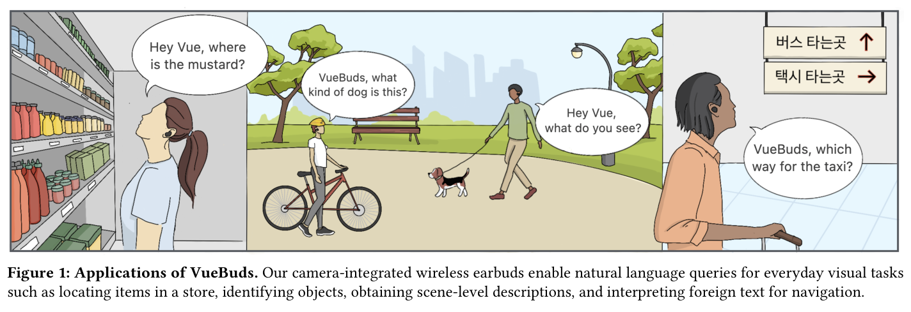
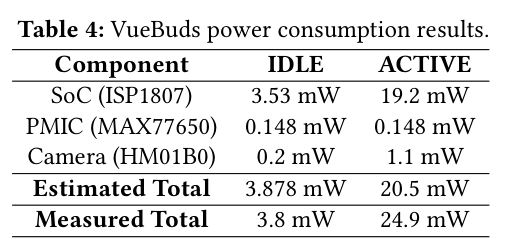
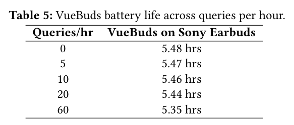
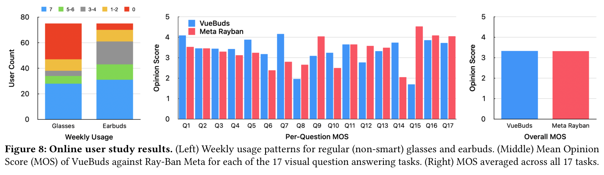
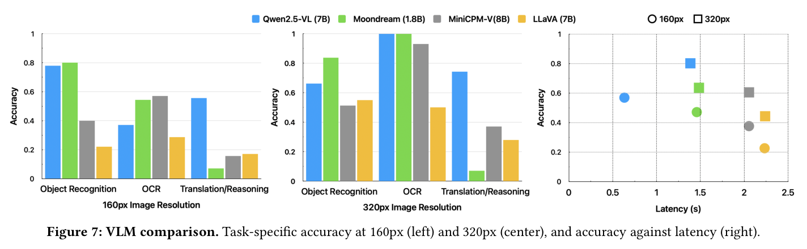
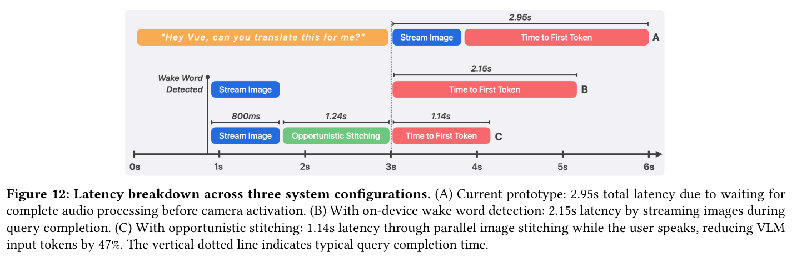
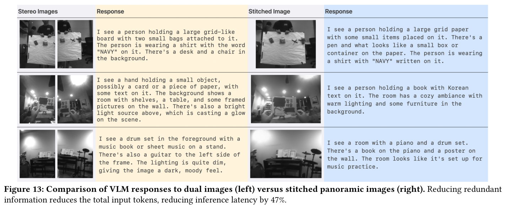

---
tags:
  - papers/more-modality-in-wearable-system
aliases:
  - "VueBuds"
date: 2026-04-13
doi: 10.1145/3772318.3791322
---

# VueBuds: Visual Intelligence with Wireless Earbuds

## 核心信息

- 标题: VueBuds: Visual Intelligence with Wireless Earbuds
- 标题翻译: VueBuds：无线耳机的视觉智能
- 作者: Maruchi Kim, Rasya Fawwaz, Zhi Yang Lim, Brinda Moudgalya, Hexi Wang, Yuanhao Zeng, Shyamnath Gollakota
- 机构: University of Washington (Paul G. Allen School; Electrical & Computer Engineering)
- 发表时间: 2026年4月13–17日
- 发表渠道: CHI 2026, Barcelona, Spain
- DOI: 10.1145/3772318.3791322
- arXiv: 2603.29095
- 论文链接: https://doi.org/10.1145/3772318.3791322
- 代码 / 项目: https://vuebuds.cs.washington.edu/
- 数据 / 资源: 无公开数据集；用户研究数据归作者所有
- 论文类型: 系统/原型论文（硬件原型 + 端到端 VLM 集成 + 用户研究）

## 原文摘要翻译

尽管无线耳机已被广泛普及，但受限于尺寸和功耗约束，其功能仍以音频为核心。
本文提出 VueBuds——首款面向自我中心视觉的摄像头集成无线耳机，能够在严格的功耗和形态因素约束内运行。
每只 VueBud 将摄像头嵌入 Sony WF-1000XM3，通过蓝牙将视觉数据流式传输至主机设备，由设备端视觉语言模型进行处理。
我们从解析和实验两个角度证明：尽管每个摄像头的视野受到面部遮挡，双目联合视角仍能提供全面的前向覆盖。
通过将 VueBuds 与视觉语言模型集成，我们构建了用于实时场景理解、翻译、视觉推理和文字读取的端到端系统；所有功能均来自低分辨率单色摄像头，通过按需激活方式功耗低于 5mW。
通过在线和现场用户研究（共 90 名参与者），我们在 17 项视觉问答任务中将 VueBuds 与智能眼镜进行对比，结果表明我们的系统达到了与 Ray-Ban Meta 相当的响应质量。
本工作将配备低功耗摄像头的耳机确立为视觉智能的有力平台，将快速进步的 VLM 能力带入最广泛采用的可穿戴形态因素之一。

## 创新点

1. **首个摄像头集成无线耳机原型**：将 Himax HM01B0 图像传感器和 PMIC 嵌入 Sony WF-1000XM3，在保留全部音频功能的同时实现 <5mW 视觉能力，开创了摄像头耳机硬件先例。
2. **双目耳级视野分析与设计空间**：系统建立了双摄像头角度偏转（0°–20°）与前向盲区、双目视野、Harmon 距离重叠的量化关系，选定 5° 角实现 98° 双目视野，盲区仅 18.6cm（低于舒适阅读距离阈值 36.8cm）。
3. **机会性图像拼接延迟优化**：在用户语音输入期间并行执行特征点拼接，将左右图合为全景，减少 47% 视觉语言模型输入词元，将端到端延迟从 2.95s 降至 1.14s。
4. **端到端多模态系统集成**：实现从唤醒词检测→双路蓝牙图像采集→多路复用→设备端 VLM 推理→语音合成响应的完整流水线。
5. **两阶段用户研究验证**：在线研究（n=74）与 Ray-Ban Meta 对比 17 项视觉问答任务；现场研究（n=16）在真实原型上验证三类任务总体准确率达 86.9%。

## 一句话总结

VueBuds 是首个将低功耗摄像头集成进真正无线耳机的系统，通过双目视野设计和机会性拼接优化，实现了与 Ray-Ban Meta 智能眼镜相当的视觉问答质量（MOS 3.33 vs 3.32），同时功耗低于 5mW。

## 研究问题

无线耳机是全球出货量最大的可穿戴设备之一（年出货量超 3.4 亿台，约为智能眼镜的 170 倍），但功能始终局限于音频领域。本文从三个研究问题出发：

- **RQ1（硬件可行性）**：真正的无线耳机能否在严格的尺寸、重量、功耗约束下集成摄像头硬件？摄像头功耗远高于典型耳机组件；视觉数据带宽也大幅高于音频，现有蓝牙协议能否承载双目视频流？
- **RQ2（视野覆盖）**：耳级摄像头能否为视觉感知提供足够的自我中心视角？耳机摄像头存在面部遮挡和后外侧偏移，双目协同能否弥补单目盲区？
- **RQ3（实时交互）**：基于蓝牙的完全无线流水线能否支持与视觉语言模型的实时多模态交互？从采集→流式传输→推理→音频响应的端到端延迟约束是否可满足？

## 数据与任务定义

*图 1：VueBuds 应用场景——定位商品、识别物体、获取场景描述、解读外文导航标识等日常视觉任务。*

### 在线用户研究（n=74）

- **参与者**：74 名成人（均龄 27.9 岁，σ=6.9），在美国通过在线便利抽样招募。
- **设计目标**：评估 VueBuds 视觉问答响应质量，与 Ray-Ban Meta 进行受控对比。
- **图像来源**：使用手机拍摄的场景图像作为统一输入（消除相机硬件差异对评分的影响），同时输入给 VueBuds 后端和 Ray-Ban Meta。
- **任务范围**：17 项视觉问答任务，涵盖场景描述、物体识别、OCR、文字翻译、视觉推理等类别。
- **评分量表**：MOS（平均意见分）1–5 分（1=差/不准确；3=较好/基本准确；5=优秀/高度准确）。

### 现场用户研究（n=16）

- **参与者**：16 名成人，在华盛顿大学本地招募，实际佩戴 VueBuds 原型进行测试。
- **任务分类**：三大类视觉问答任务：(1) 物体识别、(2) 光学字符识别（OCR）、(3) 翻译。
- **评估方式**：所有系统响应均由人工评估者验证准确性（非主观打分）。

### VLM 基准评估

- **测试模型（5 个，均 <8B 参数）**：Qwen2.5-VL (7B)、Moondream (1.8B)、MiniCPM-V (8B)、LLaVA (7B)、Gemma3 (4B)，均通过 Ollama 部署。
- **图像分辨率**：160px 和 320px 两种配置（对应 QQVGA 162×119 和 QVGA 324×239）。
- **主机设备**：Mac mini M4 Pro（基础配置）。
- **任务**：物体/场景识别、OCR、翻译/推理，每类 20 个场景，共 60 项评测样例。

## 方法主线

### 机制流程

VueBuds 端到端视觉问答分为四步：

1. 用户语音送入设备端 ASR 模块，唤醒词匹配后输出激活信号，HM01B0 从时钟门控待机状态切换为主动采集状态，生成左右各一帧 324×239 图像。
2. 左右图像帧分别编码为蓝牙低功耗数据包，经由 nRF52840 中继桥多路复用后送入主机，主机解析器按设备 MAC 地址路由，得到同步的左/右图像缓冲。
3. 用户语音仍在输入期间，拼接管线提取 ORB 特征点并对齐左右图，输出全景拼接图；全景图送入 Qwen2.5-VL，推理得到文字响应（首词元延迟 1.14s）。
4. 文字响应送入语音合成模块，生成音频流，通过蓝牙免提协议输出至耳机扬声器。

### 硬件设计

**摄像头模组组成**：
- Himax HM01B0 CMOS 图像传感器（1/11" 格式，324×324 像素阵列）
- Analog Devices MAX77650 PMIC（电源管理）
- Nordic nRF52840 蓝牙低功耗系统级芯片

上述模组通过定制 PCB 集成进 Sony WF-1000XM3 耳机，直接从耳机内置电池取电，外壳采用 3D 打印成型。

**三态功耗管理**：
- **OFF 状态**：耳机摘下或入充电盒时完全断电
- **IDLE 状态**：维持蓝牙连接，摄像头时钟门控，等待唤醒词中断
- **ACTIVE 状态**：唤醒词触发后进入，3 秒后自动回退至 IDLE

**摄像头与芯片接口**：传感器配置为单线数字视频接口传输模式，帧有效信号经外部环回转换为片选信号；QVGA 帧大小超出 DMA 传输上限，通过分两次事务解决。

**双目视野设计**（Table 2）：在 5° 角偏转配置下，双目水平视野达 98°，Harmon 距离处重叠 46%，前向盲区 18.6cm（低于舒适阅读距离阈值 36.8cm）。

### VLM 与图像策略选择

**分辨率影响**：从 160px 升至 320px（4× 像素），Qwen2.5-VL 和 Moondream 总体准确率提升 35%，LLaVA 提升 96%。
OCR 任务最为敏感，Qwen2.5-VL 在 320px 下达到完美准确率，最终选用 QVGA 分辨率尽管帧传输延迟更高（714ms vs 175ms），但文字识别性能不可妥协。

**VLM 选择**：在精度-延迟权衡曲线上，Qwen2.5-VL (7B) 在 320px 分辨率下综合表现最优，被选为最终系统 VLM。

**图像拼接策略**：采用 ORB 特征点检测实现轻量级拼接，不执行裁剪以保留最大视觉信息。
拼接后全景图减少了双图重叠区域的冗余视觉词元，VLM 推理首词元延迟降低 47%，响应质量无显著下降（Fig. 13）。

## 关键结果

### 功耗与电池表现

*表 4：VueBuds 各组件（SoC、PMIC、摄像头）在待机与主动状态下的实测功耗。*

*表 5：不同查询频率下 VueBuds 电池寿命估算。*

- 摄像头模组在主动状态下功耗 <5mW（按需激活模式）
- 即使在极端使用强度（60 次视觉查询/小时）下，电池寿命影响仅 11–14%
- 3 秒自动回退至待机是功耗控制的关键机制

### 在线用户研究：与 Ray-Ban Meta 对比

*图 8：在线用户研究结果——耳机与普通眼镜周使用率（左）及 VueBuds 与 Ray-Ban Meta MOS 对比（中/右）。*

*图 7：五种 VLM 在 160px 与 320px 分辨率下任务准确率对比及精度-延迟权衡曲线。*

在线用户研究（n=74）主要发现：

- **设备采用率差异显著**：耳机使用率（93.3%）远高于普通眼镜（62.7%），差异统计显著（$\chi^2(2)=21.98$，$p<0.001$）
- **视觉问答质量统计等同**：VueBuds+Qwen2.5-VL 在 17 项任务上 MOS=3.33，Ray-Ban Meta MOS=3.32，两者无统计显著差异

作者声称：这表明 VueBuds 达到了与商业智能眼镜相当的视觉问答质量。
需要注意：在线研究使用手机拍摄的统一图像来源，而非 VueBuds 实际相机拍摄——这是方法设计的合理选择，但也意味着该结论不能直接等同于"真实耳机拍摄图像下与 Ray-Ban Meta 相当"。

### 现场用户研究：真实硬件性能

现场研究（n=16）在真实 VueBuds 原型上进行（Fig. 11）：

- 物体识别：82.5%
- OCR：94.3%（高于物体识别，与典型任务复杂度预期相反）
- 翻译：83.8%
- **总体准确率：86.9%**

OCR 超越物体识别的原因：分辨率对文字边界的还原足以支持 Qwen2.5-VL 的文字识别，但低光或复杂背景下物体识别更容易受动态范围限制影响。

### 延迟优化路线图

*图 12：三种系统配置（当前原型/设备端唤醒词/机会性拼接）的延迟分解。*

*图 13：双图输入与拼接全景图 VLM 响应质量对比——拼接减少 47% 输入词元，响应质量无显著下降。*

| 配置 | 总延迟 | 关键机制 |
|---|---|---|
| A：当前原型 | 2.95s | 等待完整语音处理后再激活摄像头；串行执行采集→拼接→推理 |
| B：设备端唤醒词检测 | 2.15s | 唤醒词触发后立即开始图像采集，与剩余语音输入并行 |
| C：机会性拼接 | 1.14s | 用户说话期间并行拼接，减少 47% 输入词元；推理首词元延迟 σ=0.23s |

图像采集延迟均值 800.1ms（σ=0.06ms），拼接 0.123s（σ=0.01s），推理首词元 1.14s（σ=0.23s）。
配置 B/C 目前为系统设计空间分析，部分功能尚未完全集成进原型。

## 深度分析

### 为什么双目耳级视野在实践中足够

几何模型与实测的吻合度在 3% 以内（Fig. 6），验证了设计方法论的可靠性。
5° 角偏转使双目水平视野达 98°，盲区长度 18.6cm——远低于舒适阅读距离（36.8cm）。
在日常交互距离（如手持物品、阅读标签、观察桌面场景）下，VueBuds 的双目覆盖能够满足大多数前向视觉任务。

关键洞察：Harmon 距离标准（基于 233 人的舒适阅读距离实验）为盲区设计提供了有意义的人因工程基准，将"盲区可接受性"从定性判断转为可量化的设计约束。这一"以人因标准定义可接受边界"的方法可推广至其他耳级/颈级传感器的视野设计。

### 在线研究方法论：消除偏差的代价

在线研究选择手机拍摄的统一图像是方法论上的合理设计：若直接使用 VueBuds 实际拍摄（低分辨率、单色），与 Ray-Ban Meta 高质量全彩图像相比，任何 VLM 响应差异都会混入图像质量差异，无法区分是后端模型能力的差异还是前端相机硬件的差异。

但这也意味着：MOS 3.33 vs 3.32 的结论是"相同信息输入下两个 AI 后端的响应质量相当"，而非"端到端用户体验相当"。真实 VueBuds 图像的低分辨率和有限动态范围会在实际使用中引入更多误差，现场研究的 86.9% 准确率即反映了这一真实约束。

### 机会性拼接的工程意义

机会性拼接将被动等待时间（用户说话时系统原本空闲）转化为主动处理时间（并行拼接），是一种将"流水线化覆盖延迟"的系统设计思想。
47% 的词元减少直接对应 VLM 注意力计算量降低，是输入侧而非模型侧的优化，对任何"多图→单 VLM"的场景均适用。

需要注意的边界：ORB 拼接需要场景中存在足够的重复特征点；在低纹理场景（纯色墙、反光表面）下拼接可能失败，此时系统退化为双图输入，延迟回升至配置 A 水平。

## 局限

1. **硬件成像质量约束**（论文明确承认，Fig. 15）：低传感器分辨率和有限动态范围是多数失败案例的根源。细小文字（如药瓶细字、收据）OCR 失败；强光条件下物体识别显著下降。这是硬件层面的根本约束，非算法或系统设计可完全规避。
2. **形态因素不满足消费级标准**：3D 打印外壳虽保持了耳机基本形态，但尺寸和美观度与商业产品存在差距；当前选用的 Sony WF-1000XM3 已停产，实际部署需重新适配在产机型。
3. **延迟仍有差距**：当前原型 2.95s，即使经路线图优化也有 1.14s，距离流畅实时交互（<1s 感知阈值）仍有差距；配置 B/C 的优化路径尚未完全集成。
4. **在线研究图像源非真实硬件**：MOS 3.33 vs 3.32 的对比结论基于统一手机图像，不能直接推断为"VueBuds 真实拍摄图像下的视觉问答质量等同于 Ray-Ban Meta"。
5. **现场研究样本量小**：n=16 且场景偏向前向正对（坐姿桌面操作），不能代表自然行走、侧向观察等复杂使用场景。
6. **隐私问题尚无系统性解决方案**：耳机摄像头位置不显眼，但连续视觉采集（或感知到的连续采集）仍可能引发旁观者顾虑，论文仅提及未给出对策。

## 我的笔记

**可复用设计原则**：

1. **按需激活模式**：通过唤醒词触发摄像头而非持续流式传输，是在功耗受限可穿戴设备上部署视觉模态的关键架构选择。传感器代价通过使用频率分摊，而非持续功耗叠加。这一原则适用于任何"感知触发式"边缘 AI 系统。

2. **机会性流水线化**：将用户操作时间（语音输入）与系统预处理（图像拼接）并行，是将"等待时间"转化为"有效计算时间"的通用模式。设计多模态系统时，应识别哪些用户输入阶段可作为"机会窗口"触发并行预处理。

3. **双目视野设计空间量化**：通过参数化角度偏转将"视野覆盖"和"前向盲区"同时量化，并用人因工程标准设定可接受边界，是耳级/颈级传感器视野设计的可复用分析框架。

4. **多图→拼接→VLM 输入优化模式**：在多摄像头系统中，图像拼接优先于将多图分别输入 VLM，可显著减少冗余词元和推理延迟；但需对拼接失败场景设计优雅降级路径（双图回退）。

**后续研究方向**：

- 设备端唤醒词检测和机会性拼接的完整集成，在真实原型上验证 1.14s 路线图
- 低纹理/强反光场景下拼接失败率的系统性评估和降级策略
- 超分辨率或 HDR 相机模组替换 HM01B0，解决细字 OCR 失败问题
- 长时间连续佩戴下的热舒适性和社会接受度研究

## 引用

- Ray-Ban Meta 智能眼镜（论文参考文献 71）
- Qwen2.5-VL 技术报告（arXiv:2502.13923，参考文献 12/13）
- EarBit 耳机饮食检测（参考文献 16）
- Himax HM01B0 / WiseEye2 处理器（参考文献 4）
- Harmon 舒适阅读距离（参考文献 19）
- ORB 特征检测算法（参考文献 87）
- GesPrompt 协同手势 VLM 交互（参考文献 43）
